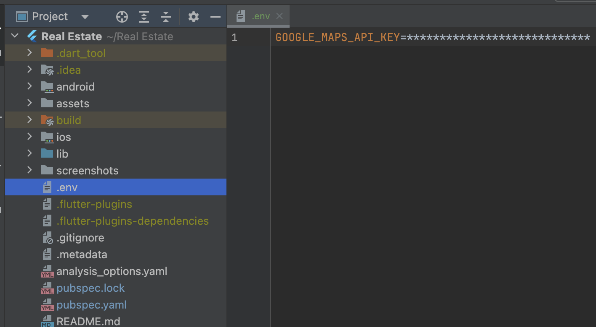
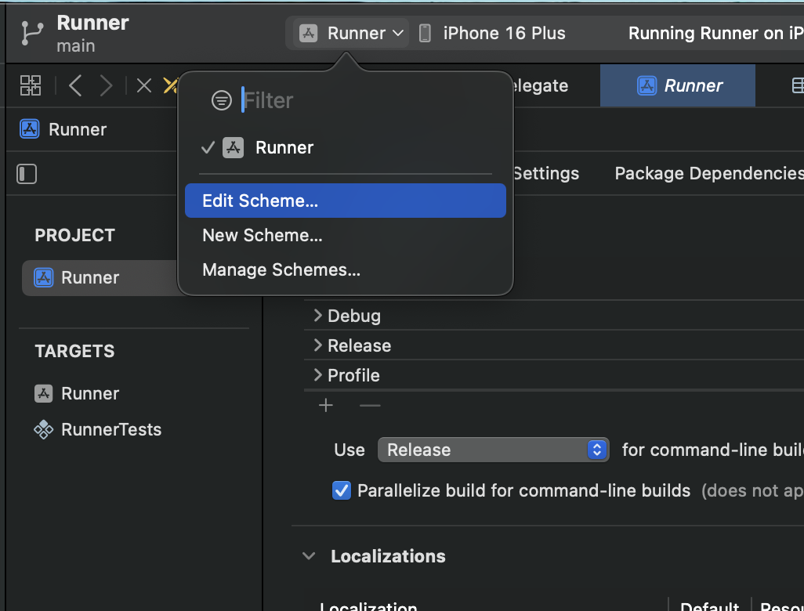
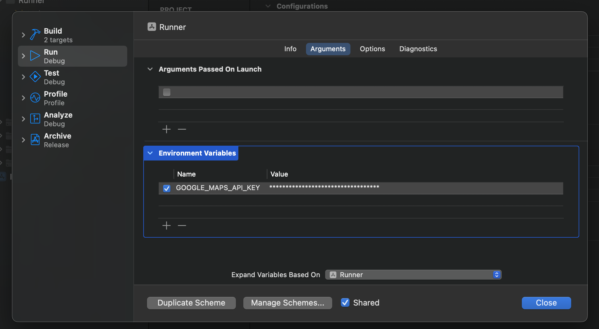
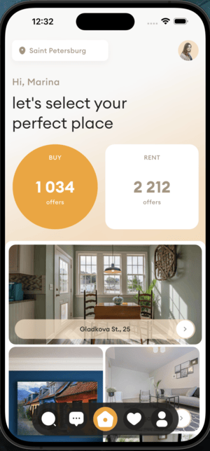
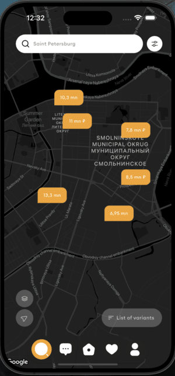

# Flutter Real Estate App


MoniePoint assessment for Flutter Engineering role

## Overview

This is a Flutter-based real estate application designed for Android. The app provides users with an easy-to-navigate interface to browse real estate listings, view property details, and connect with real estate agents.

## UI/UX Design

The UI/UX was created by **Kristina Spiridonova** for **Purrweb UI/UX Agency**. You can view the design on [Dribbble](https://dribbble.com/shots/23780608-Real-Estate-App).

## Features

- **Home / Property Listings**: Browse a list of available properties with fluid animations of a real estate agent and see a summary of their work
- **Map Details**: View and search for real estate agents around you on a map
- **Profile Functionality**: View and edit your profile (not implemented)
- **Favorites**: Save favorite properties for easy access later (not implemented)

## Technologies Used

- **Flutter**: For building the cross-platform mobile application.
- **Dart**: Programming language used in Flutter development.

## Getting Started

### Prerequisites

- Flutter SDK
- Dart SDK
- An IDE (e.g., Visual Studio Code, Android Studio)

### Installation

1. Clone the repository:
   ```bash
   git clone https://github.com/jayhymn/real_estate_app.git
   cd real_estate_app

2. Create a `.env` file in the root of your project and add the following line inside the file:
   ```plaintext
   GOOGLE_MAPS_API_KEY=***************************


3. Add `GOOGLE_MAPS_API_KEY` as an environment variable in Xcode:
   ```plaintext
   Open your project in Xcode.
   Go to Product > Scheme > Edit Scheme.
   Under the Run section, navigate to the Arguments tab.
   Add a new environment variable:
     - Name: GOOGLE_MAPS_API_KEY
     - Value: ***************************
    See the screenshots:
           


## Screenshots

                    